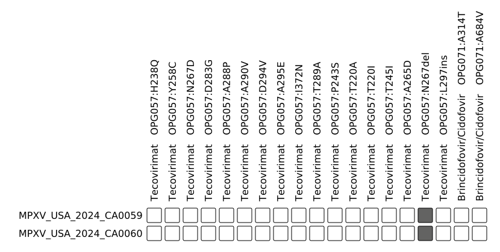

# Resistance

This tutorial demonstrates how to detect and visualize resistance-associated mutations in Mpox genomes. It uses [`nextclade`](https://github.com/nextstrain/nextclade) for mutation calling, and [`pangwas`](https://github.com/phac-nml/pangwas) to extract and visualize the resistance mutations. For example input and output files, please see the `example` folder.

1. [Resistance Mutations](#resistance-mutations)
2. [Data](#data)
3. [Analysis](#analysis)
4. [Output](#output)

## Resistance Mutations

A systematic literature review was conducted by...

## Data

The example data includes two Tecovirimat-resistance Mpox genomes from the following publication:    
[Gigante et al. (2023) Notes from the Field: Mpox Cluster Caused by Tecovirimat-Resistant Monkeypox Virus — Five States, October 2023–February 2024](https://pmc-ncbi-nlm-nih-gov.ezproxy.cscscience.ca/articles/PMC11466377/)

## Analysis

1. Install tool dependencies.

    ```bash
    conda create -c conda-forge -c bioconda -n mpox-resistance nextclade pangwas
    ```

    > If `pangwas` is not yet [available on bioconda](https://github.com/bioconda/bioconda-recipes/pull/54760), you can [install from source](https://phac-nml.github.io/pangwas/#source).

1. Activate the conda environment.

    ```bash
    conda activate mpox-resistance
    nextclade --version
    pangwas --version
    ```

1. Download the data.

    ```bash
    # Resistance mutation definitions
    wget https://raw.githubusercontent.com/phac-nml/mpox-resources/refs/heads/main/resistance/data/resistance_mutations.tsv
    # Example genomes
    wget https://raw.githubusercontent.com/phac-nml/mpox-resources/refs/heads/main/resistance/example/sequences.fasta
    ```
1. Call mutations with nextclade.

    ```bash
    nextclade run -d MPXV --output-tsv - sequences.fasta | cut -f 2- > nextclade.tsv
    ```

1. Extract resistance mutations.

    ```bash
    pangwas table_to_rtab \
      --table nextclade.tsv \
      --filter resistance_mutations.tsv \
      --prefix resistance
    ```

1. Plot resistance mutations.

    ```bash
    pangwas heatmap --rtab resistance.output.Rtab --prefix resistance
    ```

## Output

### Table

The output table of resistance mutations will be located at `resistance.output.tsv`.

|sample              |name                        |column     |regex           |Gene|Therapeutic|Gene Acession (NC_063383)|Protein                          |Start (nt)|Stop (nt)|Resistance Mutations|Residues of interest|References  |Virus-Specific Validation|
|:-------------------|:---------------------------|:----------|:---------------|:---|:----------|:------------------------|:--------------------------------|:---------|:--------|:-------------------|:-------------------|:----------------------------------------------------------------------------------------------------------------------------------------------------------------------------------------------------------------------------------------------------------------------------------------------------------------------------------------------------------------------------------------------------------------------------------------------------------------------------------------------------------------------------------------------------------------------------------------------------------------------------------------------------------------------------------------------------------------------------------------------------------------------------|:------------------------|
|MPXV_USA_2024_CA0059|Tecovirimat   OPG057:N267del|aaDeletions|.*OPG057:N267-.*|F13L|Tecovirimat|OPG057                   |Palmytilated EEV membrane protein|29875     |29877    |N267del             |267                 |Mertes et al. (2023) ... |MPOX                     |
|MPXV_USA_2024_CA0060|Tecovirimat   OPG057:N267del|aaDeletions|.*OPG057:N267-.*|F13L|Tecovirimat|OPG057                   |Palmytilated EEV membrane protein|29875     |29877    |N267del             |267                 |Mertes et al. (2023) ... |MPOX                     |

### Plot

The output heatmap of resistance mutations will be located at `resistance.plot.png`.

> **Tip**: For large sample sizes, open the SVG in Edge or Firefox to get hovertext for each variant!

